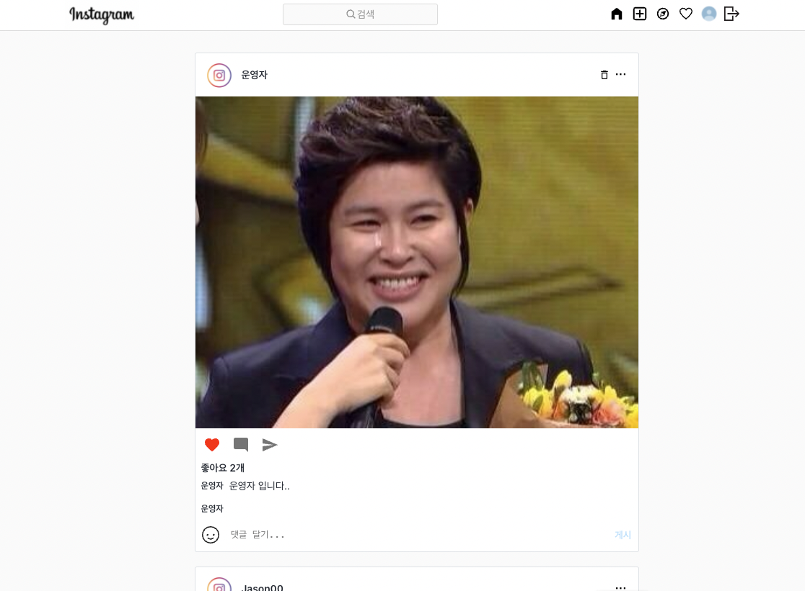

# 5주차 프로젝트 - 3조 backend

### 🖥 구현 사이트

http://happyarong.shop.s3-website.ap-northeast-2.amazonaws.com/

### 🎧 영상 링크

구현 영상 : https://www.youtube.com/watch?v=cfT0ilynghU

### 🌼 구현 메인페이지

## 프로젝트 소개

### 클로닝 대상 서비스

- Instagram
- link : https://www.instagram.com/

- 선택 이유
  파일업로드와 좋아요 기능을 구현해보는 것을 목적으로 삼고 스코프를 합리적으로 가져가기 위해 웹서비스를 탐색하던 중
  웹버전 인스타그램이 적합하다고 판단함!!

### 구현 기능

- 로그인 (JWT 토큰) 구현
- 게시글 CRUD 구현
- 게시글 좋아요 기능 구현
- 댓글 기능 구현

## 프로젝트 기간

2021/10/18 ~ 2021/10/22

## 1. Developers

### Backend (Node.js)

- 양주혁
- 장재원
- 홍성현

### Frontend (React)

- 이아영
- 조민갑
- 최진식

## 2. API, DB 설계

https://docs.google.com/spreadsheets/d/1C2EIqLhK7BeodXyVxayOFfIX0kb5Aue_fLQQk4xZhFM/edit?usp=sharing

## 3. 기술스택

|     종류      |  이름   |
| :-----------: | :-----: |
|   개발 언어   | Node.js |
| 데이터베이스  |  Mysql  |
| 웹 프레임워크 | Express |

## 4. 적용 라이브러리

|     종류     |        설명        |
| :----------: | :----------------: |
|     cors     |  교차 리소스 공유  |
|    dotenv    |   환경변수 설정    |
| jsonwebtoken | 회원 계정 JWT 적용 |
|    multer    |    이미지 저장     |
|    mysql     |       Mysql        |
| randomstring |   이미지명 지정    |
|  sequelize   |     MySQL ORM      |
|   winston    |      logging       |
|    morgan    |      logging       |
|     jest     |      testcode      |
